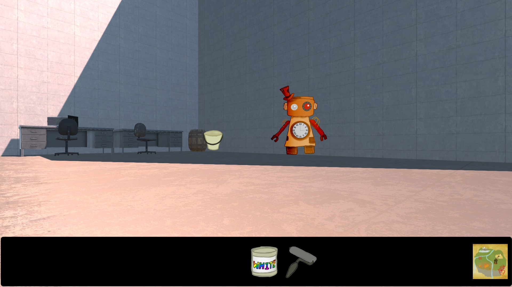

# Weird Things happened

A weird "Point and Click and Drag and Restart" puzzle game in combined 2D/3D graphics. The puzzles <s>may be</s> *are* not straightforward and resetting the game by going to sleep is actually part of the solution.

Made during the [Klagenfurt Summer Jam 2016](https://www.itec.aau.at/gamejam/).

### [Play on itch.io](https://xifiggam.itch.io/weird-things-happened)

### [Download Executable](./Releases)

 

